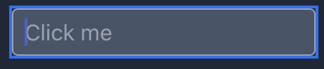

import Demo from "@/components/mdx/components/Demo.tsx"
import DemoBox from "@/components/mdx/components/DemoBox.tsx"
import Snippet, { Preview, source } from "./_snippet/index.html"
import OutlineSnippet, {
  Preview as OutlinePreview,
  source as outlineSource,
} from "./_snippet/outline.html"

| value                                                                   | description                                                          |
| :---------------------------------------------------------------------- | :------------------------------------------------------------------- |
| `5px -5px 20px rgba(147, 150, 173, 0.81)`                               | x 方向のずれ、y 方向のずれ、ぼかしの強さ、影の色を指定する           |
| `5px -5px 20px 5px rgba(147, 150, 173, 0.81)`                           | x 方向のずれ、y 方向のずれ、ぼかしの強さ、拡張距離、影の色を指定する |
| `-30px 15px 0px 0px #AFCCAF, 5px -5px 12px 2px rgba(209, 56, 29, 0.81)` | 複数の影を指定する                                                   |
| `none` (default)                                                        | 影を表示しない                                                       |

# Demo

<Demo demo={<Preview />} source={source} backgroundWhite>
  <Snippet />
</Demo>

# 概要

影を指定します。
`box-shadow`にはわかりづらいパラメータが多く、さらに複数の影を重ねる場合も多いため非常にややこしいです。
[ボックスの影作成ツール](https://developer.mozilla.org/ja/docs/Web/CSS/CSS_Backgrounds_and_Borders/Box-shadow_generator)などで実際にパラメータをいじってみると直感的に理解できるでしょう。

なお、実際のアプリケーションでは、同じパラメータを使い回すことがほとんどです。そのため、影の生成はツールに頼るのも一つの手です。

| value                                           | description                                                       |
| :---------------------------------------------- | :---------------------------------------------------------------- |
| [`offset-x`](/offset-x)（1 つ目の値）           | 影を x 軸方向へずらす距離                                         |
| [`offset-y`](/offset-y)（2 つ目の値）           | 影を y 軸方向へずらす距離                                         |
| [`blur-radius`](/blur-radius)（3 つ目の値）     | 影のぼかし度合い（省略可）                                        |
| [`spread-radius`](/spread-radius)（4 つ目の値） | 影を拡大する距離（`blur-radius`も同時に指定する必要あり、省略可） |
| [`color`](/color)（5 つ目の値）                 | 影の色                                                            |
| [`inset`](/inset)                               | `inset`を指定することで、影を内側に落とすことができる             |

export const Box = ({ style, children, className }) => (
  

    {children}
  

)

# パラメータ

## offset-x

影の x 軸方向への移動距離を指定します。

<DemoBox className="w-full grid grid-cols-4 gap-6" backgroundWhite>
  {[4, 8, 16, 32].map((param) => (
    <Box class="shadow" key={param} style={{ boxShadow: `${param}px 0px 3px #bcbcbc` }}>
      
{param}px

      
{param}px 0px 3px #bcbcbc

    </Box>
  ))}
</DemoBox>

## offset-y

影の y 軸方向への移動距離を指定します。

<DemoBox className="w-full grid grid-cols-4 gap-6" backgroundWhite>
  {[4, 8, 16, 32].map((param) => (
    <Box class="shadow" key={param} style={{ boxShadow: `0px ${param}px 3px #bcbcbc` }}>
      
{param}px

      
0px {param}px 3px #bcbcbc

    </Box>
  ))}
</DemoBox>

## blur-radius

影の y 軸方向への移動距離を指定します。

<DemoBox className="w-full grid grid-cols-4 gap-6" backgroundWhite>
  {[4, 8, 16, 32].map((param) => (
    <Box class="shadow" key={param} style={{ boxShadow: `5px 5px ${param}px #bcbcbc` }}>
      
{param}px

      
5px 5px {param}px #bcbcbc

    </Box>
  ))}
</DemoBox>

## spread-radius

影の拡大度合いを指定します。

<DemoBox className="w-full grid grid-cols-4 gap-6" backgroundWhite>
  {[4, 8, 16, 32].map((param) => (
    <Box class="shadow" key={param} style={{ boxShadow: `5px 5px 3px ${param}px #bcbcbc` }}>
      
{param}px

      
5px 5px 3px {param}px #bcbcbc

    </Box>
  ))}
</DemoBox>

## color

影の色を指定します。

<DemoBox className="w-full grid grid-cols-4 gap-6" backgroundWhite>
  {["#cbd5e1", "#94a3b8", "#475569", "#0f172a"].map((param) => (
    <Box class="shadow" key={param} style={{ boxShadow: `5px 5px 3px ${param}` }}>
      
{param}

      
5px 5px 3px {param}

    </Box>
  ))}
</DemoBox>

## inset

影の向きを変更します

<DemoBox className="w-full grid grid-cols-4 gap-6" backgroundWhite>
  {["", "inset"].map((param) => (
    <Box class="shadow" key={param} style={{ boxShadow: `${param} 5px 5px 3px #bcbcbc` }}>
      
{param}

      
{param} 5px 5px 3px #bcbcbc

    </Box>
  ))}
</DemoBox>

# 応用

## 複数の影を重ね合わせる

`5px 5px 3px #bcbcbc`のようなパラメータを、カンマ区切りで複数指定することで、影を重ね合わせることができます。

重ね合わせるケースってあるの？と思ってしまいますが、意外なことに、違和感のない表現をするために複数の影を重ねる場合があります。
以下の 2 つは複数の影を重ね合わせている例ですが、どちらも自然な表現になっていると思います。

<DemoBox className="w-full grid grid-cols-2 gap-x-6" backgroundWhite>
  {[
    ["rgba(0, 0, 0, 0.15) 0px 15px 25px", "rgba(0, 0, 0, 0.05) 0px 5px 10px"],
    [
      "rgb(204, 219, 232) 3px 3px 6px 0px inset",
      "rgba(255, 255, 255, 0.5) -3px -3px 6px 1px inset",
    ],
  ].map((boxShadow, i) => (
    

      <Box class="shadow" className="bg-gray-50" style={{ boxShadow: boxShadow.join(", ") }}>
        
{boxShadow.length}個を重ね合わせ

        {boxShadow.map((param, i) => (
          

            {param}
          

        ))}
      </Box>
      

        {boxShadow.map((param, i) => (
          <Box key={i} class="param" className="bg-gray-50" style={{ boxShadow: param }}>
            
{i + 1}つ目の影

            
{param}

          </Box>
        ))}
      

    

  ))}
</DemoBox>

[参照](https://getcssscan.com/css-box-shadow-examples)

## アウトラインを`box-shadow`で再現する

[`outline`](/outline)は、アウトラインを指定するプロパティで、フォーカス時のデザインによく用いられます。
例えば以下のフォームをクリックしてみてください。

<input
  type="text"
  className="p-2 border border-gray-400 placeholder:text-gray-300 bg-slate-600 rounded-full !mt-8 !mb-10"
  placeholder="Click me!!"
/>

青い枠線が表示されたと思います（環境によっては色が異なるかもしれません）。これが`outline`で、ブラウザデフォルトの挙動として指定されています。

この`outline`ですが、一つ厄介な点があります。それは、一部のブラウザ（iOS Safari など）では、`border-radius`が適用されないのです。
以下は iOS Safari での見た目です。アウトラインが角張った長方形で表示されており、良いデザインとは言えません。

そこで`box-shadow`を用いて`outline`のような表現を行うテクニックを用いる場合があります。
`outline`とほぼ同様のデザインを実現することができます。

<Demo demo={<OutlinePreview />} source={outlineSource}>
  <OutlineSnippet />
</Demo>

# 参照

- [MDN](https://developer.mozilla.org/ja/docs/Web/CSS/box-shadow)
- [参照](https://getcssscan.com/css-box-shadow-examples)
- [ボックスの影作成ツール](https://developer.mozilla.org/ja/docs/Web/CSS/CSS_Backgrounds_and_Borders/Box-shadow_generator)
